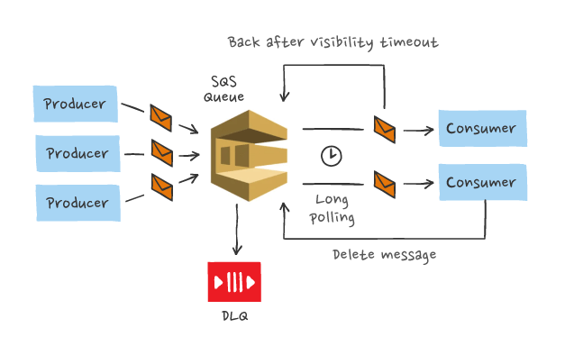

***
# ***Amazon SQS Case Study~ RedBus Case Study***

***

## *What is Amazon SQS ?*
Amazon Simple Queue Service (SQS) is a fully managed message queuing service that enables you to decouple and scale microservices, distributed systems, and server less applications. SQS eliminates the complexity and overhead associated with managing and operating message oriented middleware, and empowers developers to focus on differentiating work. Using SQS, you can send, store, and receive messages between software components at any volume, without losing messages or requiring other services to be available. Get started with SQS in minutes using the AWS console, Command Line Interface or SDK of your choice, and three simple commands.
***

### *Two types of message queues offered by SQS*

1. ***SQS Standard queues*** offer maximum throughput, best-effort ordering, and at-least-once delivery.

2. ***SQS FIFO queues*** are designed to guarantee that messages are processed exactly once, in the exact order that they are sent.

***
## *Features and Functionality of SQS*

♦ ***Retain messages in queues for up to 14 days.***  
♦ ***Message locking/ Message Visibility:*** When a message is received, it becomes “locked (Invisible for other process)” while being processed. This keeps other computers from processing the message simultaneously. If the message processing fails, the lock will expire and the message will be available again.  
♦ ***Queue sharing:*** We Securely share Amazon SQS queues anonymously or with specific AWS accounts. Queue sharing can also be restricted by IP address and time-of-day.  
♦ ***Server-side encryption (SSE):*** SSE encrypts messages as soon as Amazon SQS receives them. The messages are stored in encrypted form and Amazon SQS decrypts messages only when they are sent to an authorized consumer.  
♦ ***Dead Letter Queues (DLQ):*** Handle messages that have not been successfully processed by a consumer with Dead Letter Queues. When the maximum receive count is exceeded for a message it will be moved to the DLQ associated with the original queue. Set up separate consumer processes for DLQs which can help analyze and understand why messages are getting stuck. DLQs must be of the same type as the source queue (standard or FIFO).  

***
## *RedBus Case Study :*

>***RedBus is an Indian travel agency that specializes in bus travel throughout India by selling bus tickets throughout the country. Tickets are purchased through the company’s Website or through the Web services of its agents and partners. The company also offers software, on a Software as a Service (SaaS) basis, which gives bus operators the option of handling their own ticketing and managing their own inventories. To date, the company says they have sold over 30 million bus tickets and has more than 1750 bus operators using the software to manage their operations.***

***The Challenge***
1. The company previously ran its operations from a traditional data center by purchasing and renting its systems and infrastructure.
2. In addition to the expense, several logistical problems evolved from this arrangement. The biggest problem was that the infrastructure could not effectively handle processing fluctuations, which had a negative impact on productivity. Additionally, the procurement of servers or upgrading the server configuration was an extremely time-consuming endeavor
3. Over time, redBus realized that a better solution was imperative — a solution that offered scalability to handle the company’s processing fluctuations. redBus looked to Amazon Web Services (AWS) for a solution.

## *Why Amazon Web Services*

After testing the AWS solution on a small application for several months, the travel agency determined that it was very workable and convenient. Although redBus was quite enthusiastic about the on-demand instances and variety of instance types, several other features cemented the company’s decision to migrate completely to AWS. These features included the ability to easily manage access to servers through security groups, the easy-to-use, self-service management console, the concept of Elastic IPs, and superior support.

The company has incorporated many of the AWS products into its solution, including Amazon Elastic Compute Cloud (Amazon EC2), Elastic Load Balancing, Amazon Relational Database Service (Amazon RDS), Amazon Simple Storage Service (Amazon S3), Amazon Elastic Block Store (Amazon EBS), and Amazon CloudWatch. Charan Padmaraju, Chief Technology Officer believes that “with features like Elastic Load Balancing and multiple availability zones, AWS provides the required infrastructure to build for redundancy and auto-failover. When you incorporate these in your system/application design, you can achieve high reliability and scale.”

## *The Benefits*

Since migrating to AWS, redBus has seen measurable improvements in the bottom line. Padmaraju says, “By scaling up and down dynamically based on the load, we maintain performance as well as minimize cost. With the time savings that the IT and development staffs obtain from the AWS solution, AWS gives us an overall cost benefit of about 30–40%.” He adds, “By hosting at [the AWS Asia Pacific (Singapore) region], redBus.in gained significantly in terms of website performance by way of reduced latency (about 4x). This is a great advantage when the customers are from India.”

Of the many excellent characteristics of AWS, perhaps the most significant to redBus is the ability to “instantly replicate the whole setup on demand for testing by creating and destroying instances on demand for experimentation, thereby reducing the time to market.” Less time to market translates to increased profitability and success.

The travel agency anticipates expanding the AWS solution to include Amazon Simple Notification Service (Amazon SNS) and Amazon Simple Queue Service (Amazon SQS) for monitoring, alerts, and intercommunication. “Amazon SQS is an especially good solution for enabling messaging between external applications and our applications,” says Padmaraju.

Since joining forces with AWS, redBus has gained the freedom to experiment on new solutions and applications at minimal cost, increased the efficiency of its operations, and improved its profitability.

***

## ***Thankyou For Reading***
## ***Any query and suggestion are always welcome- [Gaurav Pagare](https://www.linkedin.com/in/gaurav-pagare-8b721a193/)***
